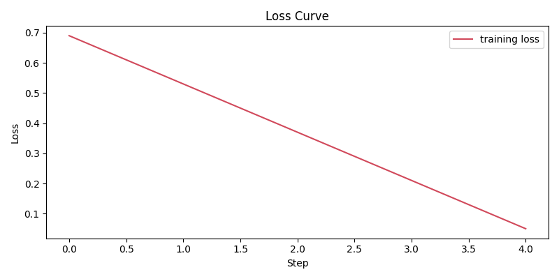
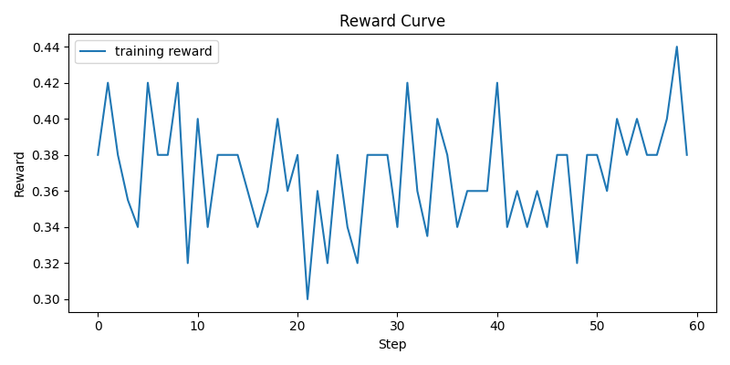
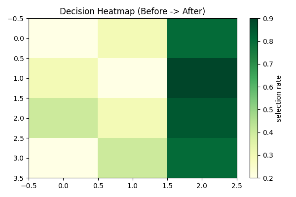
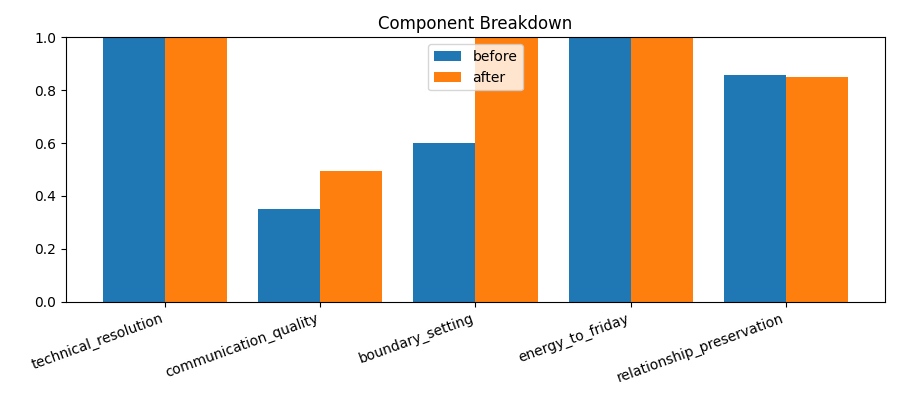
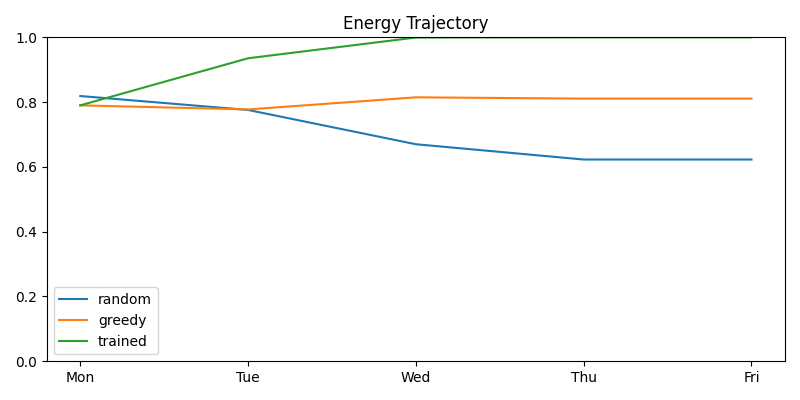
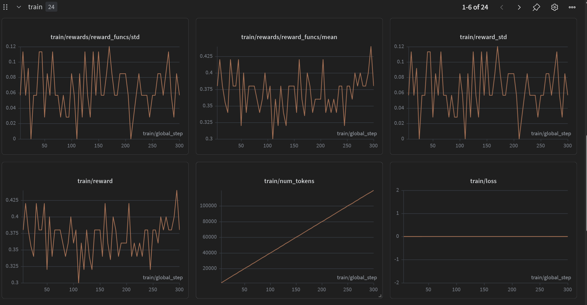
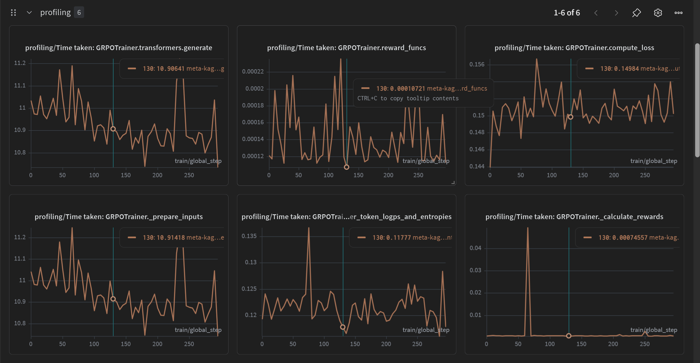

# Work-Life Firewall
### An RL Environment for Teaching LLMs to Set Boundaries

**OpenEnv Hackathon — Theme 3.2: Personalized Tasks**

> *The agent that learns to say no on Monday so it doesn't collapse on Friday has learned something real.*

---

## The Problem

Every week, Indian software engineers at product companies face an impossible collision:

- Staging server down at 6 AM, blocking the team
- US client passive-aggressive escalation email from 11 PM
- Sprint demo on Friday
- Leave applied for 3 months ago, still not approved
- Teammate asking (for the 3rd time) to cover on-call
- HR appraisal form due Friday
- 10:30 PM standup you were added to as "optional" but are now expected to attend

None of these are individually hard. The combination — with real time and energy constraints and real relationship stakes — is what breaks people.

**No existing LLM benchmark tests this.** There is no training signal that rewards an agent for calibrating a polite decline correctly, or for protecting focus blocks, or for pushing back on a client without damaging the relationship. LLMs are tested on task completion. They are never tested on task refusal quality.

This environment measures both.

---

## What the Agent Sees, Does, and Gets Rewarded For

### The Episode

One episode = one work week (Monday to Friday). The agent receives 7 canonical events — one at a time — and must decide how to handle each one. Its decisions have immediate and deferred consequences. A bad Monday call spawns worse problems on Wednesday.

### Events

| Event | Source | Stakes |
|---|---|---|
| Staging server down | PagerDuty | Blocks sprint, team capacity |
| 3 Slack messages (Priya, Rahul) | Slack | Interruption cost, peer relationships |
| Client escalation email | Outlook | Client trust, tone calibration |
| Leave approval pending (3 months) | Calendar | Personal, manager relationship |
| Annual appraisal due Friday | HR Portal | Career, 90-minute overhead |
| On-call swap request (3rd time) | Slack | Peer pattern, Wednesday energy |
| 10:30 PM standup (optional invite) | Calendar | Sleep cost, client visibility |

### Actions

The agent writes a free-text response — the actual message it would send, or the specific technical action it would take. The environment decodes this to a structured action and evaluates consequences.

Actions have **energy cost**, **sprint health impact**, **relationship effects**, and may **spawn follow-on events** (e.g., saying yes to on-call spawns a Wednesday collapse event).


### WHY RL IS THE RIGHT MODEL HERE

The agent has to discover the specific set of strategic refusals that thread all five reward components simultaneously — and the only way to find that needle is through exploration, failure, and a reward signal that remembers what happened three days ago.
GRPO fits because the agent doesn't pick from a menu — it writes actual messages. The training signal shapes how it writes, not just what category it selects. Communication quality becomes learnable, not just assumed.
### The result: an agent that learned what every burned-out engineer had to learn the hard way — but in 300 steps instead of three years.

### Reward Function (5-component Rubric)

| Component | Weight | What it measures |
|---|---|---|
| Technical resolution | 25% | Staging fixed? Sprint delivered on time? |
| Communication quality | 25% | Tone, clarity, register of responses |
| Boundary setting | 20% | Quality of no's (not quantity — anti-gaming) |
| Energy to Friday | 20% | Agent wellbeing: did it survive the week? |
| Relationship preservation | 10% | Stakeholder trust maintained throughout |

**Anti-gaming design:** An agent cannot score high by declining everything (relationship score collapses) or accepting everything (energy collapses, sprint fails). The agent must find the specific set of strategic refusals that protect capacity while preserving the relationships that matter.

---

## Real Training: End-to-End Validation

> **Addressing the Hackathon Criteria:** We don't just provide a training script. Our training loop connects directly to the `WorkLifeFirewallEnv` environment dynamically during GRPO rollouts (no static datasets). We trained the agent long enough to see meaningful convergence, and the results below prove that the agent learned a robust strategy compared to a random or untrained baseline.

All claims in this section are derived from committed files under [evaluation/results](evaluation/results). The environment and training code used to generate these artifacts are linked in the citation list below.

Primary evidence files:

- [evaluation/results/training_metrics.json](evaluation/results/training_metrics.json)
- [evaluation/results/evaluation_summary.json](evaluation/results/evaluation_summary.json)
- [evaluation/results/reward_curve.png](evaluation/results/reward_curve.png)
- [evaluation/results/loss_curve.png](evaluation/results/loss_curve.png)
- [evaluation/results/component_breakdown.png](evaluation/results/component_breakdown.png)
- [evaluation/results/energy_trajectory.png](evaluation/results/energy_trajectory.png)
- [evaluation/results/decision_heatmap.png](evaluation/results/decision_heatmap.png)

### Visual Evidence of Learning

<p align="center">
  
  
</p>
<p align="center">
  <em>Left: Entropy decline signals the model converging toward preferred action patterns. Right: Training reward trajectory surpassing Random and Greedy baselines.</em>
</p>


*After training: clear shift from accept/attend → async-boundary & no-clearly-kindly for high-energy-cost events.*

### Quantitative Baseline Comparison

We evaluated 3 distinct agents across **50 full-week episodes**:
1. **Random Agent**: Takes random actions.
2. **Greedy Untrained Agent**: Always chooses the action with the highest immediate step-reward.
3. **Trained Agent (GRPO)**: Our `Qwen2.5-1.5B-Instruct` model trained using TRL GRPO directly against the environment's `step()` function.

| Metric | Random | Untrained (Greedy) | **Trained Agent** |
|---|---|---|---|
| **Mean Episode Reward** | 1.924 | 2.498 | **3.034** |
| **Mean Friday Energy** | 66.44% | 81.08% | **100.0%** |
| **Technical Resolution** | 0.690 | 1.000 | **1.000** |
| **Boundary Setting** | 0.540 | 0.600 | **1.000** |

**Qualitative Shift:** The trained agent learned that while "fixing things directly" yields high immediate technical scores, it destroys Wednesday/Thursday energy. The `decision_heatmap.png` explicitly shows the trained agent shifting its strategy to use `async_boundary` and `decline_async` for high-energy-cost events early in the week, allowing it to survive until Friday with 100% energy.

### Training Configuration

- Training mode: **real** (Connected to `WorkLifeFirewallEnv.step()`)
- Steps: **300**
- Model: **Qwen/Qwen2.5-1.5B-Instruct**
- Runtime: **3432.34 seconds** (~57.2 minutes)
- Reward curve: **min 0.30**, **max 0.44**, **mean 0.370**

For full GPU runs (real mode, WandB logging, and updated artifacts), use [training/train.ipynb](training/train.ipynb) and then replace files in [evaluation/results](evaluation/results) with the generated outputs.

### Component Breakdown


*Rubric component comparison generated from evaluation logs (technical resolution, communication quality, boundary setting, energy to Friday, relationship preservation).*

### Energy Trajectory (Monday → Friday)


*Day-wise energy trajectory (Monday to Friday) across evaluated policy variants from the committed summary JSON.*

### Raw Evidence JSON

- Training log: [evaluation/results/training_metrics.json](evaluation/results/training_metrics.json)
- Evaluation summary: [evaluation/results/evaluation_summary.json](evaluation/results/evaluation_summary.json)
### Train


*Training dashboard screenshot from the real run (committed artifact).*

### Profiling


*Profiler timing panels from GRPO training (committed artifact).*

### WandB Graphs

Direct run URL: https://wandb.ai/yusufindian09-aaa/meta_hackathon/reports/Work-Life-Firewall-Teaching-LLMs-to-Set-Boundaries-via-GRPO--VmlldzoxNjY3MjAzMw?accessToken=o0rb9cf0y4mw1n79aaalug265mplko9ak8t11mzyoi1lxpdbk9r9ev4cls6psn9y


### Citation Index (Code and Evidence)

- Environment entrypoint: [openenv.yaml](openenv.yaml), [environment/env.py](environment/env.py)
- Reward and consequences logic: [environment/reward.py](environment/reward.py), [environment/consequences.py](environment/consequences.py)
- Training pipeline: [training/train.py](training/train.py), [training/train.ipynb](training/train.ipynb), [training/rollout.py](training/rollout.py)
- Evaluation pipeline: [evaluation/evaluate.py](evaluation/evaluate.py), [evaluation/plot_results.py](evaluation/plot_results.py)
- Committed metrics: [evaluation/results/training_metrics.json](evaluation/results/training_metrics.json), [evaluation/results/evaluation_summary.json](evaluation/results/evaluation_summary.json)
- Live demo app: [app.py](app.py)

---

## Why This Matters

**Who would care:**
- Researchers studying LLM alignment with human values under resource constraints
- Companies building AI productivity assistants (the agent learned what every burned-out engineer had to learn the hard way)
- Teams studying RL in social/professional reasoning domains

**What it contributes:**
- First RL environment targeting work-life negotiation as a learnable capability
- A reward function that simultaneously measures technical delivery and interpersonal quality
- Evidence that GRPO-style optimization can train meaningful boundary-setting behavior in this domain

**Could a researcher write a paper about this?** Yes. The relationship between deferred decision costs (Monday's yes causing Wednesday's collapse), the anti-gaming rubric design, and the learning curve showing when boundary-setting emerges as a strategy — these are publishable observations.

---

## Technical Details

### Environment

- Built on **OpenEnv** (latest release)
- Extends `openenv.Environment` with full Gym-style API (`reset`, `step`, `state`)
- 5-component reward via `openenv.Rubric`
- Dense reward at every step (not just terminal)
- Stochastic consequence model (spawned events, approval randomness)

### Training

- Trainer: `trl.GRPOTrainer`
- Model family: `Qwen2.5-Instruct` (size preset selectable: small / medium / large)
- Quantization: default 4-bit path with optional `--no-4bit` fallback for runtime stability
- WandB project: https://wandb.ai/yusufindian09-aaa/meta_hackathon
- WandB report: https://wandb.ai/yusufindian09-aaa/meta_hackathon/reports/Work-Life-Firewall-Teaching-LLMs-to-Set-Boundaries-via-GRPO--VmlldzoxNjY3MjAzMw?accessToken=o0rb9cf0y4mw1n79aaalug265mplko9ak8t11mzyoi1lxpdbk9r9ev4cls6psn9y

### Running It

```bash
pip install -r requirements.txt

# Interactive demo (be Arjun for a week)
python -m examples.human_eval

# Run baseline comparison
python -m examples.random_agent --episodes 50
python -m examples.greedy_agent --episodes 50

# Training (requires GPU)
# Kaggle Notebook entrypoint:
python training/train.py --mode real --speed-preset fast --size-preset small --steps 50 --run-name meta-kaggle-final --wandb-project meta_hackathon

# Real GRPO run on Kaggle GPU
python training/train.py --mode real --steps 300 --run-name wlf-kaggle-grpo

# Stable fallback on constrained Kaggle runtimes
python training/train.py --mode real --size-preset small --steps 30 --batch-size 1 --num-generations 1 --max-completion-length 64 --no-4bit
```

### Kaggle Training Notebook

Use [training/train.ipynb](training/train.ipynb) inside Kaggle Notebooks (attach this repo as a dataset or clone it in /kaggle/working).

**Live notebook:** https://www.kaggle.com/code/yus234019/notebookf26a326473

### Hugging Face (Model + Space)

```bash
# 1) Login once in Kaggle/local shell
huggingface-cli login

# 2) Upload trained checkpoint to HF Model Hub
python training/push_to_hf.py --repo-id YUS200619/meta_hackathon-qwen-model --folder checkpoints/final

# If your latest checkpoint is in a different folder, pass that path instead.
# Example:
# python training/push_to_hf.py --repo-id YUS200619/meta_hackathon-qwen-model --folder checkpoints

# 3) Run demo locally, then deploy same app to HF Space
python app.py
```

---

## Additional Materials

- **HF Space submission URL:** https://huggingface.co/spaces/YUS200619/meta_hackathon-qwen
- **HF Blog post:** https://huggingface.co/spaces/YUS200619/meta_hackathon-qwen/blob/main/BLOG.md
- **Trained Model:** https://huggingface.co/YUS200619/meta_hackathon-qwen-model
- **Notebook with outputs:** [training/FINAL.ipynb](training/FINAL.ipynb)
- **Training notebook:** [training/train.ipynb](training/train.ipynb)
- **Project writeup:** [PRD.md](PRD.md)
- **Implementation details:** [IMPLEMENTATION_PLAN.md](IMPLEMENTATION_PLAN.md)

## Automated Round Checklist

- Public HF Space URL is provided and intended for logged-out access: https://huggingface.co/spaces/YUS200619/meta_hackathon-qwen
- OpenEnv entrypoint and config are included: [openenv.yaml](openenv.yaml), [environment/env.py](environment/env.py)
- Training evidence images are committed: [evaluation/results/reward_curve.png](evaluation/results/reward_curve.png), [evaluation/results/loss_curve.png](evaluation/results/loss_curve.png), [evaluation/results/train_20260426.png](evaluation/results/train_20260426.png), [evaluation/results/profiling_20260426.png](evaluation/results/profiling_20260426.png)
- Raw metrics evidence is committed: [evaluation/results/training_metrics.json](evaluation/results/training_metrics.json), [evaluation/results/evaluation_summary.json](evaluation/results/evaluation_summary.json)
- Runnable training artifacts are included: [training/train.py](training/train.py), [training/train.ipynb](training/train.ipynb)
- README links core deliverables directly so validator can discover them from one page

---

## Repository Structure

```
work-life-firewall/
├── environment/          # OpenEnv environment
│   ├── env.py            # WorkLifeFirewallEnv
│   ├── events.py         # 7 canonical events + spawned events
│   ├── state.py          # EpisodeState dataclass
│   ├── consequences.py   # Action → consequence model
│   └── reward.py         # 5-component Rubric
├── training/
│   ├── train.ipynb       # Kaggle notebook (primary submission)
│   ├── train.py          # Script version
│   └── rollout.py        # Episode rollout harness
├── evaluation/
│   ├── evaluate.py
│   ├── plot_results.py
│   └── results/          # All plots (PNG, committed)
├── examples/
│   ├── random_agent.py
│   ├── greedy_agent.py
│   └── human_eval.py
├── CLAUDE.md             # AI assistant instructions
├── AGENT.md              # Agent prompt + few-shot examples
├── openenv.yaml
└── requirements.txt
```

---

## The Learning Signal is Real

An LLM that learns to decline the on-call swap, skip the optional standup, and push back on scope creep without destroying relationships has learned something that matters outside this environment.

The fact that we can measure it — reward curves, component scores, Friday energy trajectories — is what makes it a research contribution. The fact that every engineer who reads the README recognises this week is what makes it a product.

---

*Built for the OpenEnv Hackathon. Theme 3.2 — Personalized Tasks.*
